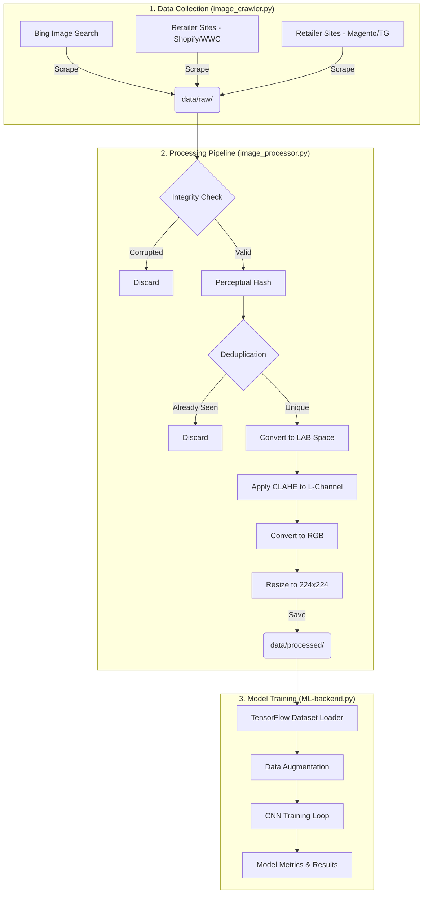

# Project Architecture Diagram

The following diagram illustrates the flow of data from the initial web crawl to the final machine learning model.

### How to view this diagram:
*   **GitHub/VS Code**: This diagram will render automatically if viewed in the GitHub web interface or VS Code with a Markdown Preview extension.
*   **Mermaid Live**: You can copy the code block above into the [Mermaid Live Editor](https://mermaid.live/) to export it as an image (PNG/SVG) for presentations.
